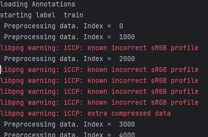
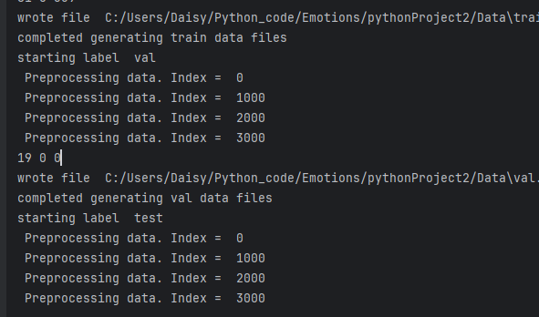

# 12.27

####  *EMOTIC数据集*是一个在无约束环境中的人的图像集合。根据他们明显的情绪状态对其进行注释。 明显的情绪状态,下面是这个Emotic数据集介绍：

数据解释：

1index 索引

2 Folder 文件夹

3 Filename文件名

4 Image Size文件大小

5 BBox 人在的地方

6 Categorical_Labels 感情标签(26种):[Emotion Categories: in addition to VAD we also established a list of 26 emotion categories that represent various state of emotions. The list of the 26 emotional categories and their corresponding definitions can be found in Table 1. Also, Fig. 3 shows (per category) examples of people showing different emotional categories.]


7 Continuous_Labels 标签(三种，每种用[1,10]来表示):Valence, Arousal, and Dominance，：[Continuous Dimensions: images are annotated according to the V AD model [7], which represents emotions by a combination of 3 continuous dimensions: Valence, Arousal and Dominance. In our representation each dimension takes an integer value that lies in the range [1 − 10]. Fig. 4 shows examples of people annotated by different values of the given dimension]


数据图片怼起来大概这么个样


8 Gender性别

9 Age 年龄


#### MatToNPY(预处理) 

Code1文件夹运行命令`python MatToNPY.py --generate_npy`

csv存到Data/emotic_pre文件夹里面了

csv和npy

#### MatToCSV(预处理) 

Code2文件夹运行命令`python MatToCSV.py --generate_npy`

csv存到Data里面了，一样的东西

#### 预处理结果

数据划分为训练测试集验证集,7:2:1

之后，验证和测试被分别由4个和2个额外的注释者进行注释。因此，验证集中的图像由5名注释者注释，而测试集中的图像由2名注释者注释。审定集的图像共由5位注释者注释，而测试集的图像则由3位注释者注释因为我们删除了有噪音的注释）

##### python将mat转换为csv，方便后面使用标签


中间有报错

因为libpng 1.6太敏感




##### npy文件存了图片信息的

拆成context, body, category, continue

文本，动作，情绪，三类别

### resnet50_places365.pth.tar

在mit网站下载的基于Places数据集预训练的ResNet50模型参数，直接使用

[下载地址]: http://places2.csail.mit.edu/models_places365/resnet18_places.pth.tar


#### 2.开心/难过/愤怒 相关性最高的特征

26维特征，合并train，test，val为coo_data文件，读取，使用cuda加速的pytorch，算相关系数

0.8-1.0     极强相关

0.6-0.8     强相关

0.4-0.6     中等程度相关

0.2-0.4     弱相关

0.0-0.2     极弱相关或无相关

UnionData.py

选择三种常见相关系数


照着找，找happiness，sadness，anger相关系数高的，三个图都找一遍投票

happiness:Pleasure0.36 affection0.25 excitement0.21

sadness:suffering0.46 


#### 3.根据文本打标签，根据环境和正在做的事打情感标签

Code2`python MatToCSV.py --data_dir C:/Users/Daisy/Python_code/Emotions/pythonProject2/Data --generate_npy`

`python main.py --mode train --data_path C:/Users/Daisy/Python_code/Emotions/pythonProject2/Data/emotic_pre --experiment_path C:/Users/Daisy/Python_code/Emotions/pythonProject2/Data`

python main.py --mode train --data_path C:/Users/Daisy/Python_code/Emotions/pythonProject2/Data/emotic_pre --experiment_path C:/Users/Daisy/Python_code/Emotions/pythonProject2/Data


开始训练


测试模型好坏

`python main.py --mode test --data_path C:/Users/Daisy/Python_code/Emotions/pythonProject2/Data/emotic_pre --experiment_path C:/Users/Daisy/Python_code/Emotions/pythonProject2/Data `

python main.py --mode test --data_path C:/Users/Daisy/Python_code/Emotions/pythonProject2/Data/emotic_pre --experiment_path C:/Users/Daisy/Python_code/Emotions/pythonProject2/Data


实际使用

```
python main.py --mode inference --inference_file C:/Users/Daisy/Python_code/Emotions/pythonProject2/Data/inference_file.txt --experiment_path C:/Users/Daisy/Python_code/Emotions/pythonProject2/Data
```


reference

https://github.com/Tandon-A/emotic

https://arxiv.org/pdf/2003.13401.pdf